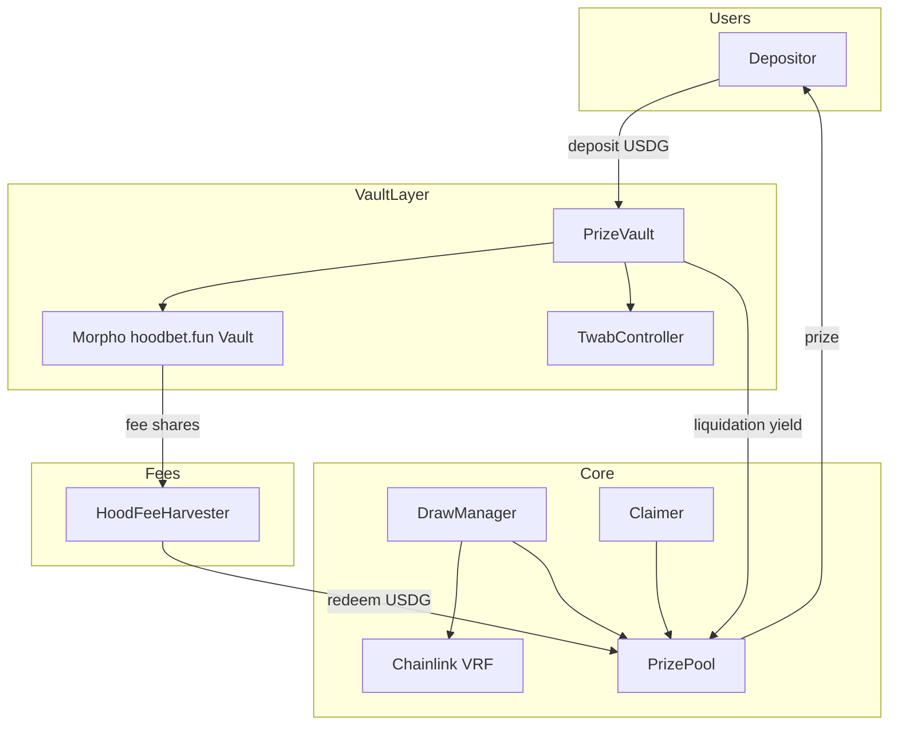

# hoodbet.fun — Architecture

## Executive summary

**hoodbet.fun** runs a **V5 prize pool hyperstructure** on Robinhood Chain (EVM L2, chain ID `4663`, Arbitrum Orbit). Depositors put USDG into a Morpho ERC-4626 vault; time-weighted balances determine lottery odds; yield and curator fees fund the prize pool.

The Morpho vault already exists on mainnet:

| Parameter | On-chain value |
|-----------|----------------|
| Name | `hoodbet.fun` |
| Address | `0xDF06045aBAE69d6e73a7F0197FED917032d22194` |
| Asset | USDG (`0x5fc5360D0400a0Fd4f2af552ADD042D716F1d168`, 6 decimals) |
| Performance fee | 50% |
| Management fee | ~5% APR |
| TVL | ~**$1 USDG** (`totalAssets = 1_000_000`, 6 decimals) |
| Fee recipients | Safe `0x5FF989aCB81e612fb54d2BDE9C6334B4C9a8f117` |
| Owner | Same Safe |

Governance and fee routing are centralized in the Safe until PrizePool + factories are deployed.

---

## Prize pool model (HoodPot engine)

HoodPot is **prize-linked savings**: depositors never lose principal; yield is auctioned into a shared prize pool; random draws pick winners proportional to time-weighted deposits.

### Core contracts

```
TwabController          → historic balance snapshots (ring buffer)
PrizePool               → immutable prize liquidity + tiered draws
PrizeVault (ERC-4626)   → wraps a yield vault; shares tracked by TWAB
TpdaLiquidationPair     → Dutch auction: yield → prize token
DrawManager             → RNG auction + awardDraw()
Claimer (VRGDA)         → bots claim prizes for winners
```

Canonical upstream source lives under [GenerationSoftware](https://github.com/GenerationSoftware) (`pt-v5-*`) — deployed as HoodPot on Robinhood Chain.

### User flow

```
1. User deposits USDG → PrizeVault
2. PrizeVault forwards assets → Morpho Vault (ERC-4626)
3. PrizeVault mints TWAB-tracked shares → TwabController records balance
4. Yield accrues (share price ↑) + Morpho fees minted to fee recipient
5. Liquidation bot auctions yield → PrizePool (prize token = USDG or WETH)
6. FeeHarvester redeems Morpho fee shares → contributes USDG to PrizePool
7. Draw bot triggers RNG → awardDraw(randomNumber)
8. Claim bot scans winners → transfers prizes
```

### Winner math (simplified)

```
PRN = hash(drawId, vault, user, tier, prizeIndex, randomNumber)
winningZone = tierOdds × userTwab × vaultContributionPortion
win if (PRN % vaultAverageSupply) < winningZone
```

Longer/larger deposits → higher odds. Vaults that contributed more yield → larger vault portion.

---

## hoodbet.fun-specific design

### Two prize funding streams

| Source | Mechanism | Contract |
|--------|-----------|----------|
| Morpho curator fees | 50% perf + 5% mgmt shares minted to recipient | `HoodFeeHarvester` redeems → `PrizePool.contributePrizeTokens` |
| Residual vault yield | Share price growth in PrizeVault wrapper | `TpdaLiquidationPair` Dutch auction |

After deployment, the Safe should:

1. Set Morpho `performanceFeeRecipient` and `managementFeeRecipient` to `HoodFeeHarvester` (timelocked).
2. Deploy `PrizeVault` via `PrizeVaultFactory` pointing at the existing Morpho vault.
3. Wire liquidation pair + claimer.

### Prize token choice

| Option | Pros | Cons |
|--------|------|------|
| **USDG** | Same as deposits, simple UX | PT audited mainly with WETH as prize token |
| **WETH** | Battle-tested on Optimism/Base | Requires DEX route for liquidators |

Recommendation: start with **USDG** on Robinhood (native earn asset); liquidators swap is trivial (1:1 mentally for users).

### RNG on Robinhood Chain

Robinhood Chain has [Chainlink price feeds](https://docs.robinhood.com/chain/oracles-and-price-feeds/). For draws:

| Option | Complexity | Recommendation |
|--------|------------|----------------|
| Chainlink VRF v2.5 | Medium — deploy `IRng` adapter | **Preferred** for new chain |
| Witnet | Low if supported | Check Robinhood support |
| Bridged L1 RNG | High latency | Fallback only |

Implement `IRng` adapter wrapping Chainlink VRF, wired to `DrawManager`.

### Governance

| Role | Holder | Powers |
|------|--------|--------|
| Protocol owner | Safe `0x5FF9…f117` | PrizeVault liquidator/claimer config, FeeHarvester admin |
| Core protocol | Immutable | PrizePool params, TWAB periods — set once at deploy |
| Curator | Safe | Morpho vault fees, allocations (existing vault) |
| Bots | Permissionless | Liquidation, draw, claim — incentivized by auctions |

---

## Deployment order (Robinhood Chain)

```
Phase 0 — Prerequisites
  ✓ Morpho vault deployed (hoodbet.fun)
  ✓ USDG on chain
  □ Chainlink VRF subscription

Phase 1 — Core hyperstructure (fork pt-v5-mainnet)
  1. TwabController
  2. PrizePool (drawPeriodSeconds=86400, tiers=4, prizeToken=USDG)
  3. ChainlinkVrfRng + DrawManager
  4. Claimer + ClaimerFactory
  5. TpdaLiquidationPairFactory + Router
  6. PrizeVaultFactory

Phase 2 — hoodbet integration
  7. HoodFeeHarvester(prizePool, morphoVault, usdg)
  8. PrizeVaultFactory.deployVault(..., morphoVault, ...)
  9. TpdaLiquidationPair for new PrizeVault
  10. Safe: point Morpho fee recipients → HoodFeeHarvester

Phase 3 — Operations
  11. Seed PrizeVault yield buffer (~$0.10 USDG)
  12. Run liquidation / draw / claim bots
  13. Deploy pt-v5-subgraph for Robinhood
  14. Launch apps/web + full dApp
```

---

## Backend requirements

| Service | Required? | Purpose |
|---------|-----------|---------|
| **Subgraph** | Yes (Goldsky free) | Deposits, draws, winners, $HOOD tiers — fork `pt-v5-subgraph` |
| **Draw bot** | Yes | `startDraw()` / `finishDraw()` on schedule |
| **Liquidation bot** | Yes | Buy yield via TPDA, contribute prizes |
| **Claim bot** | Yes | VRGDA claim for winners |
| **API (optional)** | Nice-to-have | Cached odds, recent winners for landing page |
| **Indexer cron** | MVP | `v5-draw-results` style JSON for prize history |

MVP can use a lightweight Node cron reading `PrizePool` events; production should use the official subgraph.

---

## Risk matrix

| Risk | Mitigation |
|------|------------|
| Immutable wrong PrizePool params | Extensive testnet + audit config |
| Morpho vault loss | Curated markets; proportional recovery mode in PrizeVault |
| Low TVL → auctions don't clear | Tune `minAuctionAmount`; seed reserve |
| RNG downtime | Reserve pays retries; `draw_timeout` handling |
| Fee recipient can't receive shares | `canReceiveShares` gate on Morpho — HoodFeeHarvester must pass |

---

## Contract dependency graph



---

## Naming

| Candidate | Status |
|-----------|--------|
| **hoodbet.fun** | ✅ Used for Morpho vault name |
| hoodlottery | Alternative brand |
| hoodtogether.fun | Alternative brand (community savings) |

Recommended public brand: **hoodbet.fun** with tagline *"Save together. Win together."*
